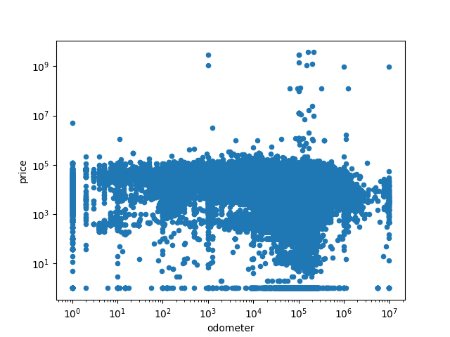
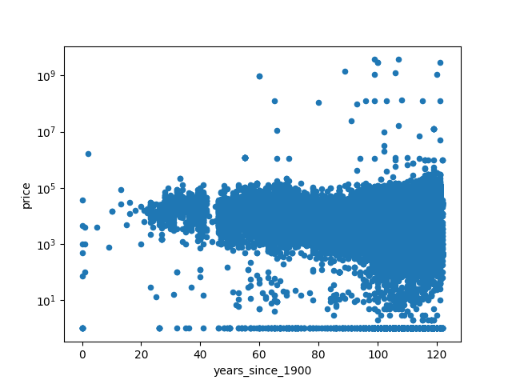
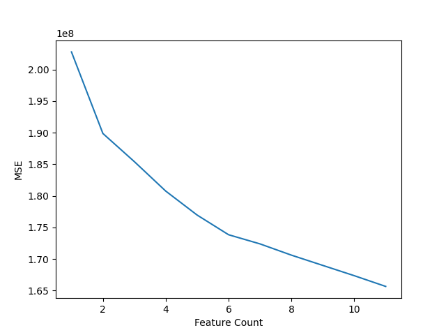

## Notebook

[Assignment 11.1](practical-application-2.ipynb)

This is an exploration of a dataset on used cars in an attempt to find what factors influence the sold price of a used car. The original had ~3M rows, but the one used for this assignment was 426K rows to speed up processing.

## Data cleaning

As expected of real-world data, it's very messy. See the [notebook](practical-application-2.ipynb) for more in-depth information and reasoning.

* Dropped `id` and `VIN` columns as they're irrelevant
* Dropped `model` column because there were just too many unique values to be useful
* Removed the NaNs in `year` and `odometer` because there weren't very many
* Dropped `cylinders` and `paint_color` because was too much NaN
* Filled the NaN in `condition`, `fuel`, `drive`, and `type` with `"unknown"`
* Grouped together the rare values in `title_status`, `transmission`, and `fuel` rows there was one value that was really frequent but everything else was rare
* Changed `year` to `years_since_1900` (with the appropriate numerical adjustment) mainly because it felt right
	* I assume it would help a linear regression model, because a "2020" model is presumably more than a 1% increase in value compared to a "2000" model
	* It would also significantly reduce the chance of overflowing should `PolynomialFeatures` be used
* Removed rows with a `price` >=1,000,000, because no way is a *used* car dealership actually going to sell that
* Dropped rows with a `price` <100 because those are probably errors; those would be excellet to be used for predicting prices on, but I didn't get around to that
* Removed rows that had a `year` before 1920, because there weren't very many and those cars are clearly not intended for daily use
	* Maybe it would be better to remove more older cars, because anything >50 years old is not intended for a general consumer. However, the customer demographics of this used car dealership is unknown, so assumptions can be detrimental.
* Dropped `manufacturer`, `state`, and `region` because there were too many unique values, however they are probably good data points
* Encoded `drive`, `type`, `title_status`, `transmission`, `condition`, and `fuel` with one-hot encoding

### Plots

Before dropping the clearly garbage datapoints, this is what the `odometer` and `years_since_1900` values looked like against price:

## Models

### Just a simple linear regression

Creating a linear regression model on the two numeric features, `years_since_1900` and `odometer`, the MSE was ~220M. Not terrible, but these are not the best features to use if you're only going to use two. This was not intended to be a serious model, merely something to test my code worked.

### SequentialFeatureSelector

As expected, increasing the feature count decreases the MSE. SequentialFeatureSelector greedily found these were the 10 most significant features (in order): `years_since_1900`, `drive_fwd`, `fuel_gas`, `transmission_automatic`, `drive_unknown`, `fuel_diesel`, `odometer`, `condition_unknown`, `type_pickup`, `type_truck`.

### GridSearchCV

Initially I split the dataset using my own random seed, however the Ridge and Lasso models did not converge on a useful alpha. After switching to simple cross-validation (such as setting `cv = 10`), the results were much more useful. Building a Pipeline using `StandardScaler()` and `Ridge()`, the alpha was `1519.9`. Using `Lasso()` took too long. Ridge found these were the 10 most significant features (in order, by absolute value): `years_since_1900`, `fuel_diesel`, `drive_fwd`, `odometer`, `fuel_gas`, `drive_4wd`, `type_pickup`, `transmission_not`, `transmission_automatic`, `type_truck`.

## Conclusion

A used car dealership looking to optimize its inventory should focus on the newest cars, diesel fuel, 4-wheel drive, low odometer values, manual transmissions (more specifically "not automatic"), and "fair" condition. These values seem to be optimized for trucks (or a "pickup", I don't know the difference), but while they may have better margins, fewer people shop for trucks, so a used car dealership still needs to stock up non-trucks.

Actually, the dataset merely lists "price", but it's not clear if that's the sold price or list price. So maybe trucks are listed with higher prices but aren't sold at that price. Then maybe the high-value trucks sit on the lot for a long time without the intention of being sold, or to be used for [price anchoring](https://en.wikipedia.org/wiki/Anchoring_effect). Anyway, assuming the price is the sold price, the dealership now knows what to focus on. There should be another investigation into price differences between trucks and normal cars, but I don't know what constitutes a "normal car" and I ran out of time.
